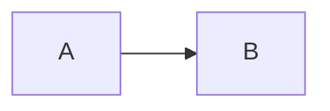

# Languages

* actionscript3
* apache
* applescript
* asp
* brainfuck
* c
* cfm
* clojure
* cmake
* coffee-script, coffeescript, coffee
* cpp – C++
* cs
* csharp
* css
* csv
* bash
* diff
* elixir
* erb – HTML + Embedded Ruby
* go
* haml
* http
* java
* javascript
* json
* jsx
* less
* lolcode
* make – Makefile
* markdown
* matlab
* nginx
* objectivec
* pascal
* PHP
* Perl
* python
* profile – python profiler output
* rust
* salt, saltstate – Salt
* shell, sh, zsh, bash – Shell scripting
* scss
* sql
* svg
* swift
* rb, jruby, ruby – Ruby
* smalltalk
* vim, viml – Vim Script
* volt
* vhdl
* vue
* xml – XML and also used for HTML with inline CSS and Javascript
* yaml

---

