# 마크다운 이야기

<!-- 사용처 -->
## 사용처

1. Readme Files (Github, etc)  
2. Forum & Blog Posts
3. Static Site Generators

## 포맷의 종류

1. 제목 (Headings)
2. 코드블럭 (Blocks of Code)
3. 목록 (Lists)
4. 이미지 (Images)
5. 강조 (Emphasis)
6. 인용구 (Blockquotes)
7. 링크 (Links)
8. 수평선 (Horizontal Rules)

## 제목 : `숫자 기호와 제목이름 사이에 공백 추가`

> # 제목 1 (`#`)
>
> ## 제목 2 (`##`)
>
> ### 제목 3 (`###`)
>
> #### 제목 4 (`####`)
>
> ##### 제목 5 (`#####`)
>
> ###### 제목 6 (`######`)

---

## 공백넣기

+ `nbsp` &nbsp; Add 1 spaces.
+ `ensp` &ensp; Add 2 spaces.
+ `emsp` &emsp; Add 4 spaces. (Tab key)

---

## 줄바꿈
>
> 일반문장 그대로 타이핑후 끝에서 줄바꿈은 &emsp; `공백 + 공백`

## 단락
>
> 또는 단락 사이에 공백을 넣음

---

## 링크 (Link) : `[링크명](URL)`

> 이것은 하이퍼링크 - [헬로우월드 바로가기](https://vivabm.com "ViVaBM WebSite")

---

## 강조 (Emphaszing)

일반 문장  
*기울어진 문장 (1)* : `*문장*`  
*기울어진 문장 (2)* : `_문장_`
**굵은 문장 (1)** : `**문장**`  
**굵은 문장 (2)**  `__...__`  
***굵고 기울어진 문장 만들기 (1)*** `___문장___`  
***굵고 기울어진 문장 만들기 (2)*** `***문장***`  
~~취소선 만들기~~ `~~문장~~`  
수평선   `---`  

## 리스트 (List) : `-, +, * 아이템, 1. 번호 아이템`

### UL

+ 아이템 1
+ 아이템2
  + 서브 아이템 1
  + 서브 아이템 2
+ 아이템 3

### OL

1. 번호 아이템 1
2. 번호 아이템 2
   1. 서브 번호 아이템 1
   2. 서브 번호 아이템 2
3. 번호 아이템 3  

---

## 인용구 (Blockquotes) : `> 좋은 글...., >> 연관된 중첩문`
>
> 하루에 3시간 걸으면 7년 후에 지구를 한바퀴 돌 수 있다 - 사무엘 존슨
>
> 다음 문장
>
>> 중첩된 문장
>>
>> + 중첩 내부에 서브 문장
>>
---

## 코드블럭 (Code Block) :  ` ``` ` *Code Blocks* ` ``` `

` ```html `

```html
<head>
    <title>Hello, World</title>
</head>
```

` ``` `

` ```javascript `

```javascript
function someFunc() {
    alert('Hello World');
}
```

` ``` `

## bash

```bash
    npm install
    npm start
```

## Python

```python
    def add(num1, num2):
        return num1 + num2

```

## CSharp

```csharp
    public class Program 
    {
        public static void Main() 
        {
            Console.WriteLine("Hello, World");
        }
    }
```

> 문장안에 ***Inline Code Block*** 넣기
>  
> \`싱글 백틱으로 Code 를 양쪽으로 감쌈\`
>
>> this is an \` `<div>` \`  
>> `<p> This is a inline block by p tag <p/>`
---

## 탈출문자, Escape Caracter : `\`
>
> 탈출 시키기 => \*여보세요\*  
---

## Table : `|` 으로 칸 만들기

`|title 1 | title 2 |`
`| ---  | --- |`
`| 내용 1 | 내용 2 |`  

|Name|Email|
|---|---|
|ViV|<viv@gamil.com>|
|Hello|<hello@gmail.com>|
---

## Task List : `[ ]`

+ [X] Task 1
+ [ ] Task 2
+ [ ] Task 3

---

## HTML : 일반 Html Tag 를 그대로 사용

``  
  

## 이미지 (Image): `[](Click Go To URL)`

[](https://vivabm.com)

---

## 테이블

> 일반
>
|제목|내용|설명|
|------|---|---|
|테스트1|테스트2|테스트3|
|테스트1|테스트2|테스트3|
|테스트1|테스트2|테스트3|

> 정렬
>
|제목|내용|설명|
|:---|---:|:---:|
|왼쪽정렬|오른쪽정렬|중앙정렬|
|왼쪽정렬|오른쪽정렬|중앙정렬|
|왼쪽정렬|오른쪽정렬|중앙정렬|

> 셀서식
>
|제목|내용|설명|
|---|---|---|
|테스트1|*강조1*|테스트3|
|테스트1|**강조2**|테스트3|
|테스트1|<span style="color:red">강조3</span>|테스트3|
---

## ***수학 기호를 넣는 방법***

## [Ref. LaTex](https://en.wikibooks.org/wiki/LaTeX/Mathematics)

## Default Examples

+ $1+1=2$
+ $4-3=1$
+ $2\times 2 = 4$  
+ $a \ast b$  
+ $a \cdot b$  
+ $^1/_2$  
+ $a / b$
+ $a \div b$
+ $a \colon b$
+ $\sqrt[3]{a}$
+ $\sqrt[n]{a}$
+ $\Delta x = x_1 - x_0$
+ $\angle$
+ $30\degree45\rq30\rq\rq$
+ $\frac{df}{dx}$
+ $A=\int_1^4\frac{x^2}{x} dx$
+ $z=3+2i$
+ $A=\begin{bmatrix}1&2&3\cr4&5&6\end{bmatrix}$

```markdown
- $1+1=2$
- $4-3=1$
- $2\times 2 = 4$  
- $a \ast b$  
- $a \cdot b$  
- $^1/_2$  
- $a / b$
- $a \div b$
- $a \colon b$
- $\sqrt[3]{a}$
- $\sqrt[n]{a}$
- $\Delta x = x_1 - x_0$
- $\angle$
- $30\degree45\rq30\rq\rq$
- $\frac{df}{dx}$
- $A=\int_1^4\frac{x^2}{x} dx$
- $z=3+2i$
- $A=\begin{bmatrix}1&2&3\cr4&5&6\end{bmatrix}$
```

---

## 소괄호

$$(1 + 2)$$

```markdown
$(1 + 2)$
```

---

## 중괄호  

$$\{1 + 2\}$$

```markdown
$\{1 + 2\}$
```

---

## 대괄호  

$$\left[\;1 + 2\;\right]$$

```markdown
$\left[\;1 + 2\;\right]$
```

---

## 자동괄호 리사이징  

$$\left(\frac{2}{3}\right)$$

```markdown
$$\left(\frac{2}{3}\right)$$
```

---

## 수동 괄호 리사이징 (big, Big, bigg, Bigg)  

$$\Bigg(\bigg(\Big(\big(1\big)\Big)\bigg)\Bigg)$$

```markdown
$$\Bigg(\bigg(\Big(\big(1\big)\Big)\bigg)\Bigg)$$
```

---

## 위 첨자 지수 (Power) 표기법  

$$2^2 = 4$$

```markdown
$$2^2 = 4$$
```

---

## 아래 첨자 (Indices)  

$$a_1, a_2, a_3$$

```markdown
$$a_1, a_2, a_3$$
```

---

***점 (dot) 수와 수사이 값이 존재함을 생략적 표기법***  

```markdown
$$ 0\dots11$$
```

$$ 0\dots11$$

---

## 중앙에 점 (dot) 표기법

$$1\cdots10$$

```markdown
$$1\cdots10$$
```

---

## 새로방향 점 표기법

$$\vdots$$

```markdown
$$\vdots$$
```

---

## 대각선 방향 점 표기법  

$$\ddots$$

```markdown
$$\ddots$$
```

---

## 루트 (거듭제곱근)  

$$\sqrt{2}$$

```markdown
$$\sqrt{2}$$
```

---

## 펙토리얼 (Factorial) 표기법  

$$n! = 1 \times 2 \times 3 \times 4 \ldots n$$
$$n! = \prod_{k=1}^n k$$

```markdown
$$n! = 1 \times 2 \times 3 \times 4 \ldots n$$
$$n! = \prod_{k=1}^n k$$
```

---

## 합집합 표기법  

$$\{a, b, c\} \cup \{d, e\}= \{a, b, c, d, e\}$$

```markdown
$$\{a, b, c\} \cup \{d, e\}= \{a, b, c, d, e\}$$
```

---

## 교집합 표기법

$$\{a, b, c\} \cap \{a, b, d\} = \{a, b\}$$

```markdown
$$\{a, b, c\} \cap \{a, b, d\} = \{a, b\}$$
```

---

## 수학공식, 수식번호 표기법

$$X_{1,j} \mathbf{F}X_{2,j} = 0, \tag{1}$$

```markdown
$$X_{1,j} \mathbf{F}X_{2,j} = 0, \tag{1}$$
```

---

## 삼각함수 (싸인, 코싸인, 탄젠트, 세타) 표기법  

---

$$90^\circ$$
$$\cos(1\theta) = \cos^2\theta - sin^2\theta \ldots \tan (2\theta)$$

```markdown
$$90^\circ$$
$$\cos(1\theta) = \cos^2\theta - sin^2\theta \ldots \tan (2\theta)$$
```

---

## 파이 (PI) 표기법  

$$\pi, \Pi, \phi$$

```markdown
$$\pi, \Pi, \phi$$
```

---

## 각도 표기법  

$$90^\circ$$

```markdown
$$90^\circ$$
```

---

## 극한 표기법 (limit)  

$$\lim_{x \to \infty} \exp(-x) = 0$$

```markdown
$$\lim_{x \to \infty} \exp(-x) = 0$$
```

---

## 시그마 (for)  

$$\displaystyle\sum_{i=1}^{10} t_i$$
$$\sum_{i=1}^{10} t_i$$

```markdown
$$\displaystyle\sum_{i=1}^{10} t_i$$
$$\sum_{i=1}^{10} t_i$$
```

---

## 미분 표기법 (Differential)  

$$\dv{Q}{t} = \dv{s}{t}$$

```markdown
$$\dv{Q}{t} = \dv{s}{t}$$
```

---

## 적분 (Intergral) 표기법  

$$\int_0^\infty \mathrm{e}^{-x}\, \mathrm{d}x$$
$$\int\limits_a^b$$

```markdown
$$\int_0^\infty \mathrm{e}^{-x}\, \mathrm{d}x$$
$$\int\limits_a^b$$
```

---

## 행렬 (Matrix)

$$A_{m,n} =
\begin{pmatrix}
a_{1,1} & a_{1,2} & \cdots & a_{1,n} \\
a_{2,1} & a_{2,2} & \cdots & a_{2,n} \\
\vdots & \vdots & \ddots & \vdots \\
a_{m,1} & a_{m,2} \cdots & a_{m,n}
\end{pmatrix}$$

```markdown
$$A_{m,n} = 
\begin{pmatrix}
a_{1,1} & a_{1,2} & \cdots & a_{1,n} \\
a_{2,1} & a_{2,2} & \cdots & a_{2,n} \\
\vdots & \vdots & \ddots & \vdots \\
a_{m,1} & a_{m,2} \cdots & a_{m,n}
\end{pmatrix}$$
```

---

## 백터, 스칼라 (Vector, Scalar) 표기법

$$\overrightarrow{AB}$$

$$\overline{AB}$$

```markdown
$$\overrightarrow{AB}$$

$$\overline{AB}$$
```

---

***기본 규칙***

1. 인라인 수식
   1. `$` 또는 `\(`와 `\)` 사이에 수식을 넣습니다.
   2. 예를 들어, `$y = mx + b$`와 같이 작성할 수 있습니다.

2. 디스플레이 수식:
   1. `$$` 또는 `\[`와 `\]` 사이에 수식을 넣습니다.
   2. 예를 들어, `$$y = \frac{1}{2}x^2 + 3x - 5$$`와 같이 작성할 수 있습니다.

3. LaTeX 수식:
    1. LaTeX 수식을 사용하여 수식을 작성할 수 있습니다.
    2. 이를 위해서는 `$` 대신 `$$`를 사용하여 디스플레이 수식을 작성해야 합니다.
    3. 예를 들어, `$$\int_{0}^{1} x^2 dx = \frac{1}{3}$$`와 같이 작성할 수 있습니다.

4. 수학기오
   + `+`, `-`, `*`, `/`: 덧셈, 뺄셈, 곱셈, 나눗셈
   + \div, \times,
   + `^`: 거듭제곱
   + `_`: 아래 첨자
   + `{}`: 그룹화
   + `\sqrt`: 제곱근
   + `\frac`: 분수 (fraction, 프렉션)
   + `\int`: 적분
   + `\sum`: 시그마 합
   + `\lim`: 극한
   + `\infty`: 무한대
   + `\pi`: 원주율
   + `\theta`: 세타
   + `cos` : 코싸인
   + `sin` : 싸인
   + `tan` : 탄젠트

---

## ETC

$$\alpha, \Alpha, \beta, \Beta, \gamma, \Gamma, \pi, \Pi, \phi, \varphi, \mu, \Phi$$

```markdown
$$\alpha, \Alpha, \beta, \Beta, \gamma, \Gamma, \pi, \Pi, \phi, \varphi, \mu, \Phi$$
```

---

$a \bmod b$

```markdown
$a \bmod b$
```

---

$f(n) = n^5$  
Hello $^3/_7$ World  
hello$\;$fine  
$\rightarrow$  

```markdown
$f(n) = n^5$
Hello $^3/_7$ World   
hello$\;$fine
$\rightarrow$
```

---

***논문 기호***

| 이름 | 명령어 | 반환 | 이름 | 명령어 | 반환 |
|-|-|-|-|-|-|
| 알파 | `\alpha` | $\alpha$ | 크사이 | `\xi` | $\xi$ |
| 베타 |`\beta` | $\beta$ | 오미크론 | o |$o$|
| 감마 |`\gamma` | $\gamma$ |파이 | \pi |$\pi$|
| 델타 |`\delta` | $\delta$ | 로 | \rho |$\rho$|
| 엡실론 |`\epsilon` | $\epsilon$|시그마|`\sigma`|$\sigma$|
| 제타 |`\zeta` | $\zeta$ |타우 | `\tau` |$\tau$|
| 에타 |`\eta` | $\eta$ | 입실론 | `\upsilon` |$\upsilon$|
| 세타 |`\theta` | $\theta$ |파이 | `\phi` |$\phi$|
| 이오타 |`\iota` | $\iota$ |카이 | `\chi` |$\chi$|
| 카파 |`\kappa` | $\kappa$ |오메가 | `\omega` |$\omega$|
| 람다 |`\lambda` | $\lambda$ | 뉴 | `\nu` | $\nu$|
| 뮤 |`\mu` | $\mu$|-|-|-|-|

---

***관계연산자***

|이름|명령어|반환|이름|명령어|반환|
|-|-|-|-|-|-|
|합동|`\equiv`|$\equiv$|근사|`\approx`|$\approx$|
|비례|`\propto`|$\propto$|같고 근사|`\simeq`|$\simeq$|
|닮음|`\sim`|$\sim$|같지 않음|`\neq`|$\neq$|
|작거나 같음|`\leq`|$\leq$|크거나 같음|`\geq`|$\geq$|
|매우작음|`\ll`|$\ll$|매우 큼|`\gg`|$\gg$|

---

***논리기호***

|이름|명령어|반환|이름|명령어|반환|
|-|-|-|-|-|-|
|wedge|`\wedge`|$\wedge$|vee|`\vee`|$\vee$|
|논리합|`\oplus`|$\oplus$|어떤|`\exists`|$\exists$|
|오른쪽 화살표|`\rightarrow`|$\rightarrow$|왼쪽 화살표|`\leftarrow`|$\leftarrow$|
|왼쪽 큰화살표|`\Leftarrow`|$\Leftarrow$|오른쪽 큰화살표|`\Rightarrow`|$\Rightarrow$|
|양쪽 큰화살표|`\Leftrightarrow`|$\Leftrightarrow$|양쪽 화살표|`\leftrightarrow`|$\leftrightarrow$|
|모든|`\forall`|$\forall$||||
|불릿|`\bullet`|$\bullet$|부정|`\neq`|$\neq$|

---

***집합기호***

|이름|명령어|반환|이름|명령어|반환|
|-|-|-|-|-|-|
|교집합|`\cap`|$\cap$|합집합|`\cup`|$\cup$|
|상위집합|`\supset`|$\supset$|진상위집합|`\supseteq`|$\supseteq$|
|하위집합|`\subset`|$\subset$|진하위집|`\subseteq`|$\subseteq$|
|부분집합아님|`\not\subset`|$\not\subset$|공집합|`\emptyset, \varnothing`|$\emptyset$, $\varnothing$|
|원소|`\in`|$\in$|`원소아님`|`\notin`|$\notin$|

---

***기타***

|이름|명령어|반환|이름|명령어|반환|
|-|-|-|-|-|-|
|hat|`\hat{x}`|$\hat{x}$|widehat|`\widehat{x}`|$\widehat{x}$|
|물결|`\tilde{x}`|$\tilde{x}$|wide물결|`\widetilde{x}`|$\widetilde{x}$|
|bar|`\bar{x}`|$\bar{x}$|overline|`\overline{x}`|$\overline{x}$|
|check|`\check{x}`|$\check{x}$|acute|`\acute{x}`|$\acute{x}$|
|grave|`\grave{x}`|\(\grave{x}\)|dot|`\dot{x}`|$\dot{x}$|
|ddot|`\ddot{x}`|\(\ddot{x}\)|breve|`\breve{x}`|$\breve{x}$|
|vec|`\vec{x}`|$\vec{x}$|델,나블라|`\nabla`|$\nabla$|
|수직|`\perp`|$\perp$|평행|`\parallel`|$\parallel$|
|부분집합아님|`\not\subset`|$\not\subset$|공집합|`emptyset`|$\emptyset$|
|가운데 점|`\cdot`|$\cdot$|…|`\dots`|$\dots$|
|가운데 점들|`\cdots`|$\cdots$|세로점들|`\vdots`|$\vdots$|
|나누기|`\div`|$\div$|물결표|`\sim`|$\sim$|
|플마,마플|`\pm, \mp`|$\pm$, $\mp$|겹물결표|`\approx`| $\approx$ |
|prime|`\prime`|$\prime$|무한대|`\infty`|$\infty$|
|적분|`\int`|$\int$|편미분|`\partial`|$\partial$|
|한칸띄어|`x\,y`|$x\,y$|두칸|`x\;y`|$x \; y$|
|네칸띄어|`x \quad y`|$x \quad y$|여덟칸띄어|`x \qquad y`|$x \qquad y$|

---

## 그리스문자의 용도

그리스 문자는 수학, 과학, 공학, 철학, 언어학 등 다양한 분야에서 사용됩니다.  
각각의 그리스 문자는 특정한 용도를 가지며, 일반적으로 다음과 같은 용도로 사용됩니다  

1. 알파 (α): 순서나 레벨을 나타내는 데 사용됩니다. 또한 각도, 가속도, 알파 입자 등을 나타내는 데 사용됩니다.  
2. 베타 (β): 물리학에서 전자의 속도나 궤도, 각도의 측정, 또는 화학에서 결합 에너지와 같은 다양한 용도로 사용됩니다.
3. 감마 (γ): 물리학에서 방사선, 광학에서 파장, 화학에서 화학 반응속도 등을 나타내는 데 사용됩니다.
4. 델타 (δ): 수학에서 미분, 물리학에서 비율 변화율, 화학에서 전하 밀도 등을 나타내는 데 사용됩니다.
5. 엡실론 (ε): 물리학에서 유전율, 반도체 이론 등을 나타내는 데 사용됩니다.
6. 제타 (ζ): 수학에서 제타 함수와 같은 다양한 수식에서 사용됩니다.
7. 에타 (η): 물리학에서 흡수 계수와 같은 다양한 용도로 사용됩니다.
8. 쎄타 (θ): 수학에서 각도, 물리학에서 회전 각도, 통계학에서 각도의 분포와 같은 다양한 용도로 사용됩니다.
9. 요타 (ι): 그리스어 단어에서 '작은 것'을 의미하며, 수학에서는 단위 벡터와 같은 용도로 사용됩니다.
10. 카파 (κ): 물리학에서 저항 계수와 같은 다양한 용도로 사용됩니다.
11. 람다 (λ): 수학에서 파장 길이, 물리학에서 전자파나 입자의 파장, 화학에서 분광학적 분석 등을 나타내는 데 사용됩니다.
12. 뮤 (μ): 물리학에서 자기 유도율과 같은 다양한 용도로 사용됩니다.
13. 누 (ν): 물리학에서 파동수, 화학에서 분광학적 분석에서 진동수와 같은 다양한 용도로 사용됩니다.

## Mermaid Examples

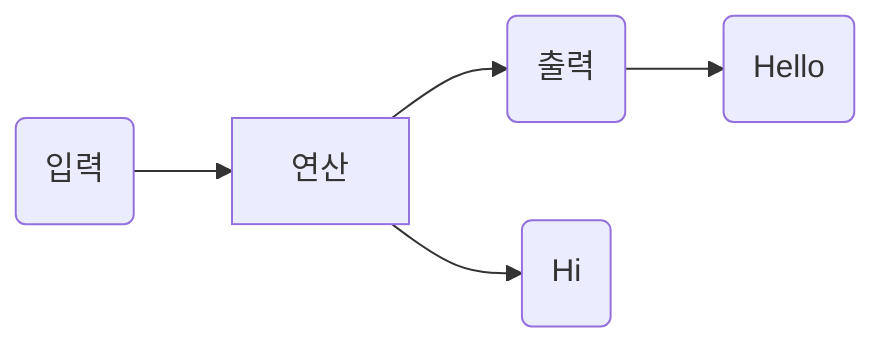

```markdown
graph LR
A(입력)-->B[연산]-->C(출력)
C-->G(Hello)
B-->H(Hi)
```

---

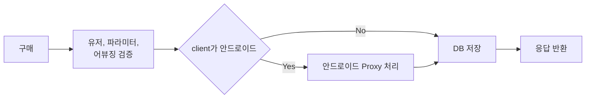

```markdown
flowchart LR
    A[구매] --> B;
    B[유저, 파라미터, \n 어뷰징 검증] --> C;
    C{client가 안드로이드} -->|Yes| E;
    C -->|No| G;
    E[안드로이드 Proxy 처리] --> G;
    G[DB 저장] --> I;
    I[응답 반환];
```

---

```markdown
TB(= TD) : 위에서 아래로
BT : 아래에서 위로
RL : 오른쪽에서 왼쪽으로
LR : 왼쪽에서 오른쪽으로
```

---

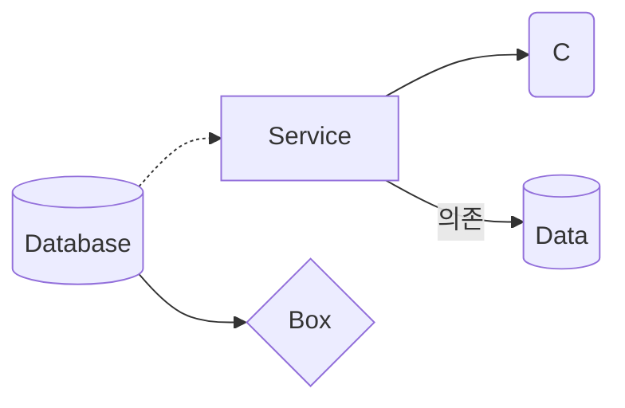

```markdown
flowchart LR
    A[(Database)]
    B[Service]
    C(C)
    D{Box}
    E[(Data)]
    A-.->B
    B-->C
    B-->|의존|E
    A-->D
```

---

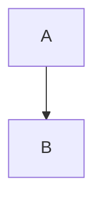

```markdown
graph TD
    A-->B
```

---

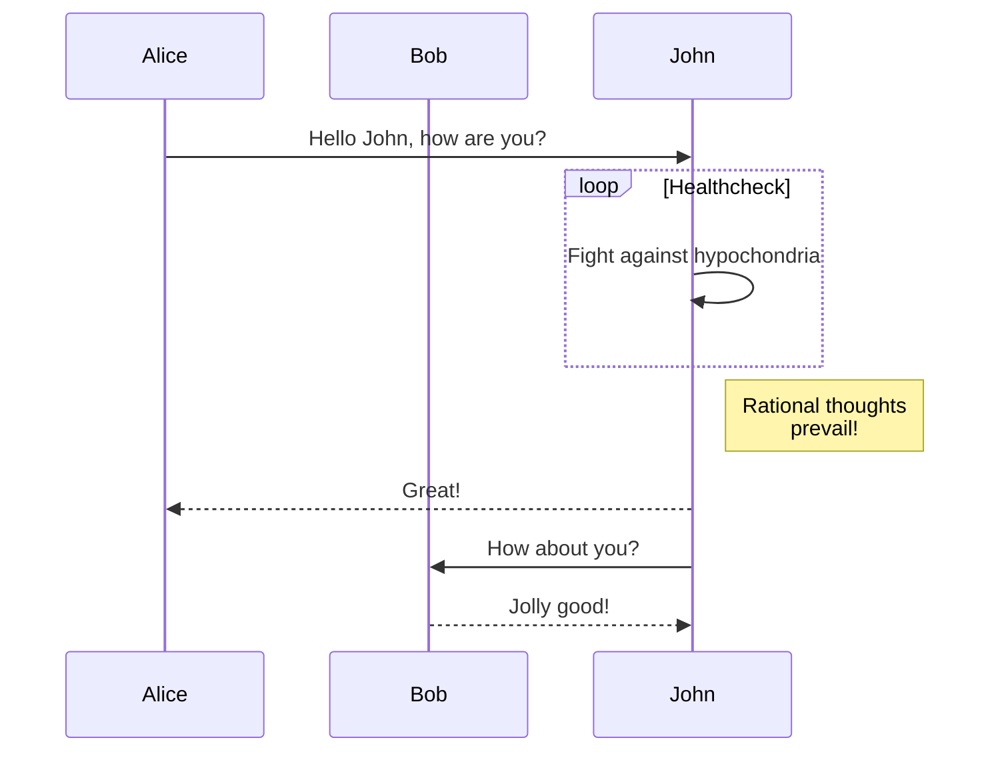

```markdown
sequenceDiagram
    participant Alice
    participant Bob
    Alice->>John: Hello John, how are you?
    loop Healthcheck
        John->>John: Fight against hypochondria
    end
    Note right of John: Rational thoughts <br/>prevail!
    John-->>Alice: Great!
    John->>Bob: How about you?
    Bob-->>John: Jolly good!
```

---

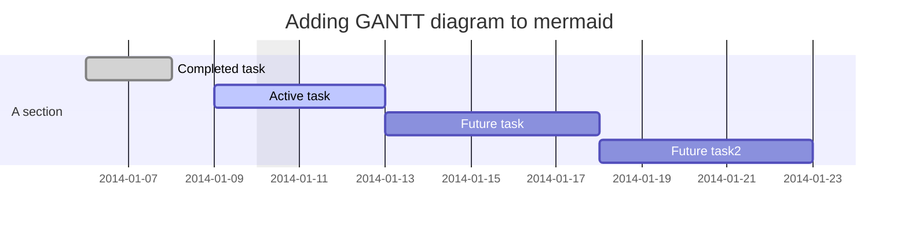

```markdown

gantt
dateFormat  YYYY-MM-DD
title Adding GANTT diagram to mermaid
excludes weekdays 2014-01-10

section A section
Completed task            :done,    des1, 2014-01-06,2014-01-08
Active task               :active,  des2, 2014-01-09, 3d
Future task               :         des3, after des2, 5d
Future task2               :         des4, after des3, 5d

```

---

## Class diagram

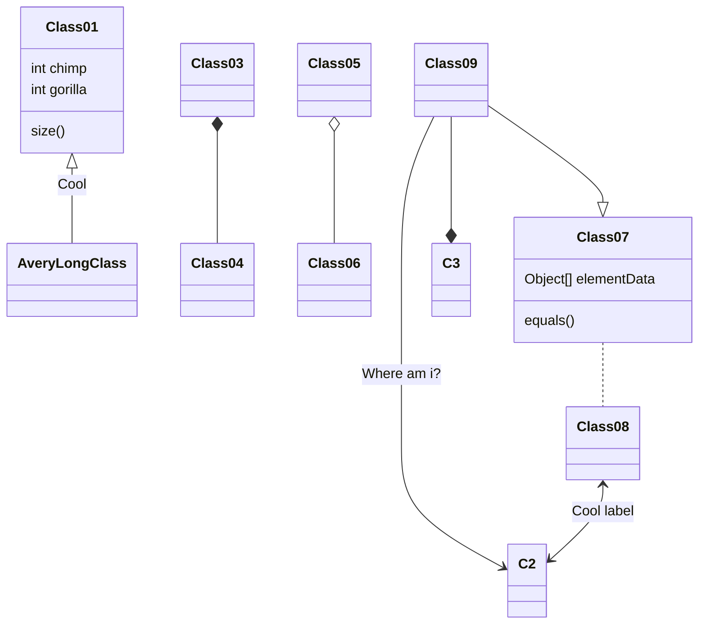

```markdown

classDiagram
Class01 <|-- AveryLongClass : Cool
Class03 *-- Class04
Class05 o-- Class06
Class07 .. Class08
Class09 --> C2 : Where am i?
Class09 --* C3
Class09 --|> Class07
Class07 : equals()
Class07 : Object[] elementData
Class01 : size()
Class01 : int chimp
Class01 : int gorilla
Class08 <--> C2: Cool label

```

---

## Git graph

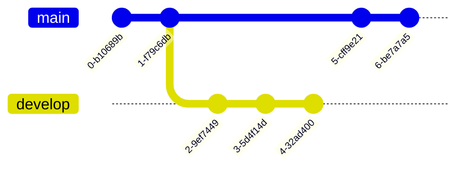

```markdown
    gitGraph
       commit
       commit
       branch develop
       commit
       commit
       commit
       checkout main
       commit
       commit
```

---

## Entity Relationship Diagram

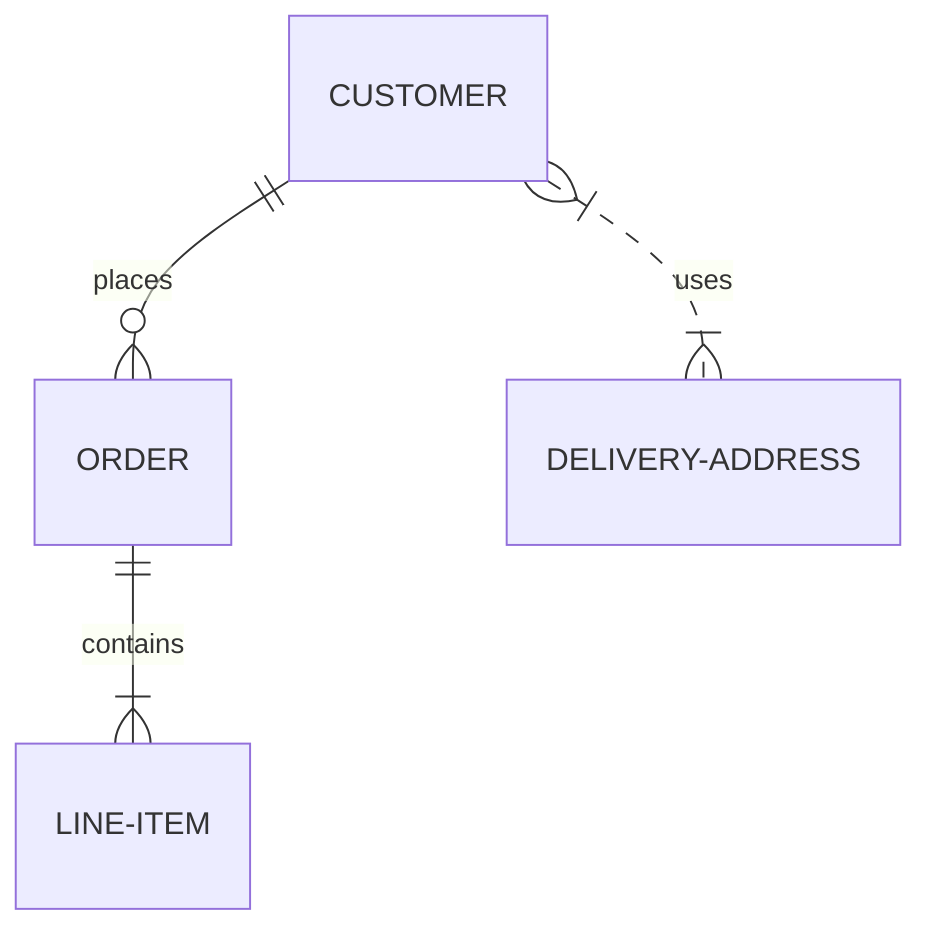

```markdown
erDiagram
    CUSTOMER ||--o{ ORDER : places
    ORDER ||--|{ LINE-ITEM : contains
    CUSTOMER }|..|{ DELIVERY-ADDRESS : uses
```

---

## User Journey Diagram

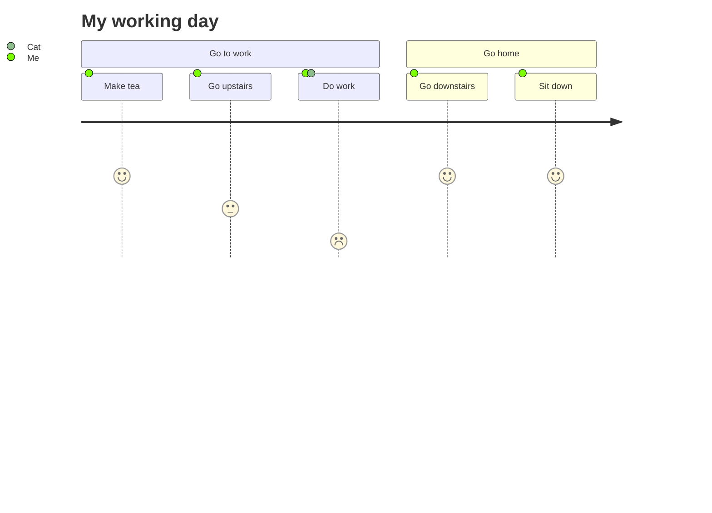

```markdown
journey
    title My working day
    section Go to work
      Make tea: 5: Me
      Go upstairs: 3: Me
      Do work: 1: Me, Cat
    section Go home
      Go downstairs: 5: Me
      Sit down: 5: Me

```

---

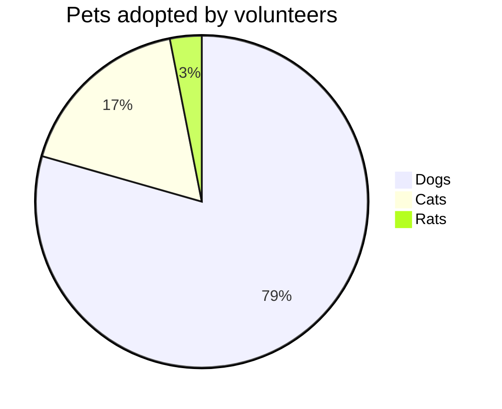

```markdown
pie title Pets adopted by volunteers
    "Dogs" : 386
    "Cats" : 85
    "Rats" : 15
```

---

## Timeline

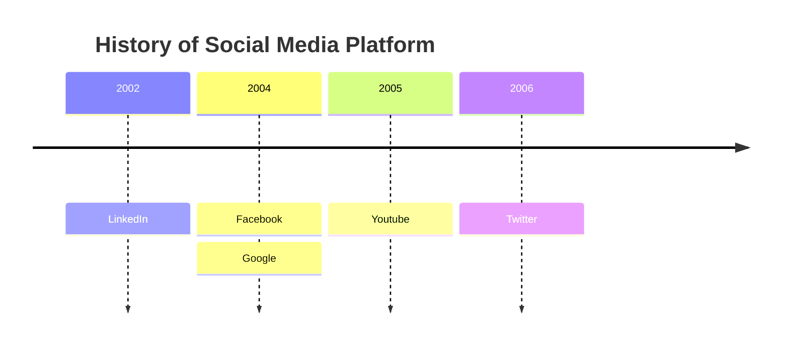

```markdown
timeline
    title History of Social Media Platform
    2002 : LinkedIn
    2004 : Facebook
         : Google
    2005 : Youtube
    2006 : Twitter
```

---

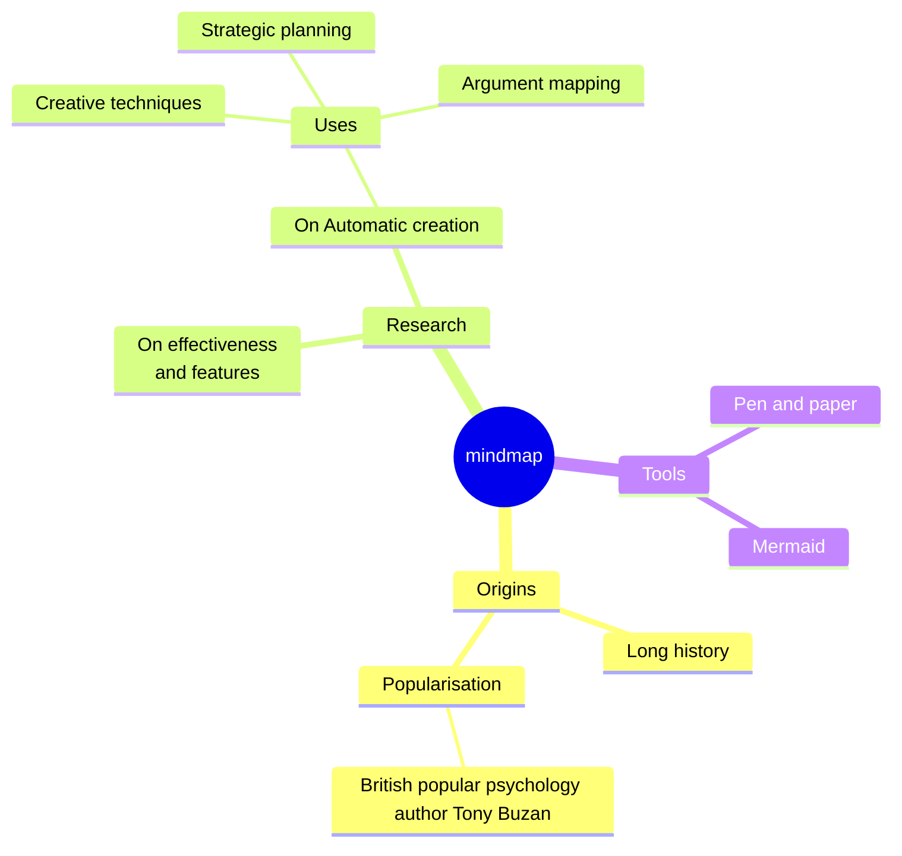

```markdown
mindmap
  root((mindmap))
    Origins
      Long history
      ::icon(fa fa-book)
      Popularisation
        British popular psychology author Tony Buzan
    Research
      On effectiveness<br/>and features
      On Automatic creation
        Uses
            Creative techniques
            Strategic planning
            Argument mapping
    Tools
      Pen and paper
      Mermaid
```

---

Links[^]

[^]: https://vivabm.com
